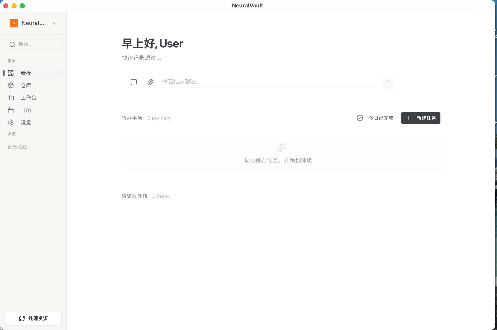

# NeuralVault

**本地优先的 AI 知识管理系统**

[功能特性](#功能特性) • [安装](#安装) • [使用指南](#使用指南) • [技术栈](#技术栈) • [开发](#开发)

---

## 简介

NeuralVault 是一款跨平台桌面应用，帮助你捕获、组织和检索个人知识。通过 AI 驱动的智能分类和语义搜索，让你的笔记、文档、图片等资源形成可探索的知识网络。

**核心理念：** 本地优先、隐私安全、AI 增强。

## 功能特性

### 📥 快速捕获
- **HUD 快捷窗口** - 一键唤醒，随时捕获灵感
- **多格式支持** - 文本、图片、PDF
- **剪贴板集成** - 直接粘贴内容
- **上下文感知** - 自动记录来源窗口和时间戳

### 🧠 智能组织
- **AI 自动分类** - LLM 驱动的主题归类
- **知识图谱** - 资源、主题、任务形成 DAG 结构
- **语义搜索** - 基于向量的混合检索（FTS + Dense）
- **OCR 识别** - 图片和 PDF 文字提取

### 💬 AI 对话
- **RAG 增强** - 基于你的知识库回答问题
- **多模型支持** - 支持 Gemini 等 LLM Provider
- **上下文关联** - 在任务/资源上下文中对话

### ✅ 任务管理
- **轻量任务** - 快速创建、管理待办事项
- **日历视图** - 按截止日期查看任务
- **资源关联** - 任务与相关资源自动关联

## 主页预览



## 安装

### 下载预编译版本

前往 [Releases](https://github.com/Asnly/NeuralVault/releases) 下载适合你系统的安装包：

| 平台 | 下载 |
|------|------|
| macOS (Apple Silicon) | `NeuralVault_x.x.x_aarch64.dmg` |
| Windows | `NeuralVault_x.x.x_x64-setup.exe` |

### 从源码构建

#### 前置要求

- Node.js 20+
- Rust (stable)
- Tauri CLI 2.x (`npm install -g @tauri-apps/cli`)
- Protoc (Protocol Buffers 编译器)

#### 构建步骤

```bash
# 克隆仓库
git clone https://github.com/Asnly/NeuralVault.git
cd NeuralVault

# 安装前端依赖
npm install

# 开发模式运行
npm run tauri dev

# 构建生产版本
npm run tauri build
```

## 使用指南

### 快速开始

1. **设置 AI Provider** - 前往 Settings，配置 Gemini API Key
2. **捕获第一个资源** - 在 Dashboard 点击 + 或使用 HUD 快捷键
3. **查看智能分类** - 资源会自动归类到相关主题
4. **开始对话** - 在 Workspace 中与 AI 讨论你的知识

### 核心概念

| 概念 | 说明 |
|------|------|
| **Resource** | 原始资源（文本、图片、PDF） |
| **Topic** | 主题分类，可嵌套形成层级 |
| **Task** | 待办任务，可关联资源和主题 |

三类节点通过 `contains`（包含）和 `related_to`（关联）形成有向无环图（DAG），支持多父节点结构。

### AI Pipeline

资源捕获后自动进入 AI 处理流程：

1. **内容解析** - 文本提取 / OCR 识别
2. **生成摘要** - LLM 生成 100 字以内摘要
3. **向量化** - 本地 Embedding 模型计算向量
4. **智能分类** - 基于语义搜索匹配或创建主题

### 键盘快捷键

| 快捷键 | 功能 |
|--------|------|
| `Cmd/Ctrl + Shift + Space` | 打开 HUD 快速捕获 |
| `Cmd/Ctrl + K` | 全局搜索 |
| `Cmd/Ctrl + S` | 保存编辑 |

## 技术栈

### 前端
- **React 18** + TypeScript
- **Vite** - 构建工具
- **Tailwind CSS** - 样式框架
- **Radix UI** - 无障碍组件库
- **TipTap** - Markdown 编辑器

### 后端 (Rust)
- **Tauri 2.0** - 跨平台桌面框架
- **SQLite** - 主数据存储（SQLx）
- **LanceDB** - 内嵌向量数据库
- **FastEmbed** - 本地向量化
- **pdf_oxide + ocr_rs** - 文档解析与 OCR

### AI / ML
- **Gemini API** - LLM 对话与分类
- **multilingual-e5-small** - 文本向量化 (384 维)
- **CLIP ViT-B/32** - 图像向量化 (512 维)

所有向量计算在本地完成，无需依赖外部服务。

## 开发

### 项目结构

```
NeuralVault/
├── src/                    # React 前端
│   ├── api/               # Tauri 命令调用
│   ├── components/        # UI 组件
│   ├── hooks/             # 自定义 Hooks
│   └── pages/             # 页面组件
├── src-tauri/             # Rust 后端
│   ├── src/
│   │   ├── commands/      # Tauri 命令
│   │   ├── db/            # 数据库操作
│   │   └── services/      # AI、解析服务
│   └── Cargo.toml
└── docs/                   # 项目文档
```

### 本地开发

```bash
# 启动开发服务器（前端 + Rust 热重载）
npm run tauri dev

# 仅启动前端
npm run dev
```

### SQLx 离线元数据

修改 SQL 后需更新离线元数据：

```bash
cd src-tauri
DATABASE_URL="sqlite:///path/to/neuralvault.sqlite3" cargo sqlx prepare -- --lib
```

## 路线图

- [ ] 更多 LLM Provider（OpenAI、Claude、Ollama）
- [ ] 更多格式(Email, URL, EPUB)
- [ ] 数据导出

## 贡献

欢迎提交 Issue 和 Pull Request！

## 许可证

本项目基于 [Apache License 2.0](LICENSE) 开源。
