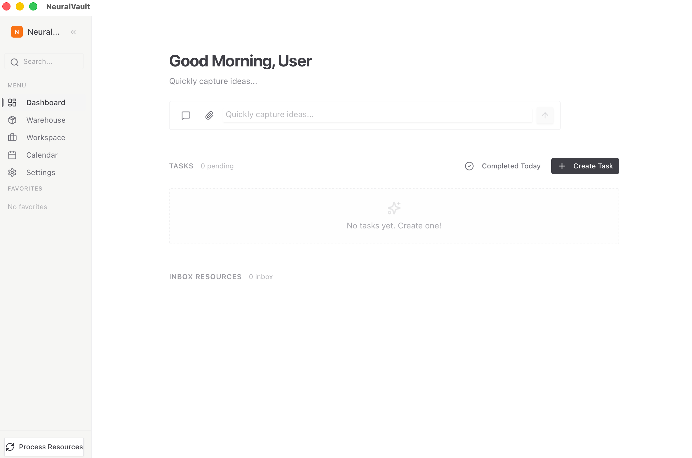

# NeuralVault

Local-first AI knowledge management for notes, documents, images, and tasks.

NeuralVault is a desktop app built with Tauri, Rust, React, and SQLite. It helps you capture information quickly, organize it into a graph of resources and tasks, and query your personal knowledge base with AI-assisted retrieval.

## Status

This project is still early-stage and evolving quickly. The current public release focuses on a clean local-first foundation, desktop workflows, and an AI-assisted resource pipeline.

## Highlights

- Quick capture via a lightweight HUD window
- Local resource storage with SQLite and LanceDB
- OCR and PDF parsing for richer ingestion
- Semantic retrieval over captured knowledge
- AI-assisted summaries, categorization, and chat
- Task management linked to resources and topics

## Screenshot



## Privacy Model

NeuralVault is designed to keep your data local by default. Notes, resources, embeddings, and metadata are stored on your machine. External API calls are only made for the AI providers you explicitly configure.

## Tech Stack

- Frontend: React 18, TypeScript, Vite, Tailwind CSS, Radix UI, TipTap
- Desktop shell: Tauri 2
- Backend: Rust, SQLx, SQLite
- Retrieval: LanceDB, FastEmbed
- Parsing: `pdf_oxide`, `pdfium-render`, `ocr_rs`

## Requirements

- Node.js 20+
- Rust stable
- Protoc
- Tauri CLI 2.x

Install the Tauri CLI once if you do not already have it:

```bash
npm install -g @tauri-apps/cli
```

## Getting Started

```bash
git clone https://github.com/Asnly1/NeuralVault.git
cd NeuralVault
npm install
npm run tauri dev
```

To build a production package:

```bash
npm run tauri build
```

## AI Provider Setup

At the moment, the main tested provider flow is Gemini. After launching the app:

1. Open `Settings`
2. Add your provider API key
3. Start capturing resources from the dashboard or HUD

## Project Layout

```text
.
├── src/                  # React frontend
├── src-tauri/            # Rust backend and Tauri app shell
├── assets/               # Repository screenshots and media
├── public/               # Static frontend assets
└── third_party_model/    # Bundled OCR and PDF runtime assets
```

## Development Notes

- `npm run dev` starts the frontend only
- `npm run tauri dev` starts the full desktop app
- `third_party_model/` contains OCR and PDF runtime files used by the parser pipeline

If you change SQL queries and use SQLx offline metadata, regenerate it with:

```bash
cd src-tauri
DATABASE_URL="sqlite:///path/to/neuralvault.sqlite3" cargo sqlx prepare -- --lib
```

## Roadmap

- More AI providers
- More import formats
- Better export and backup flows
- Improved onboarding for first-time setup

## Contributing

Issues and pull requests are welcome. Small, focused changes are easiest to review.

## License

Licensed under the [Apache License 2.0](LICENSE).
